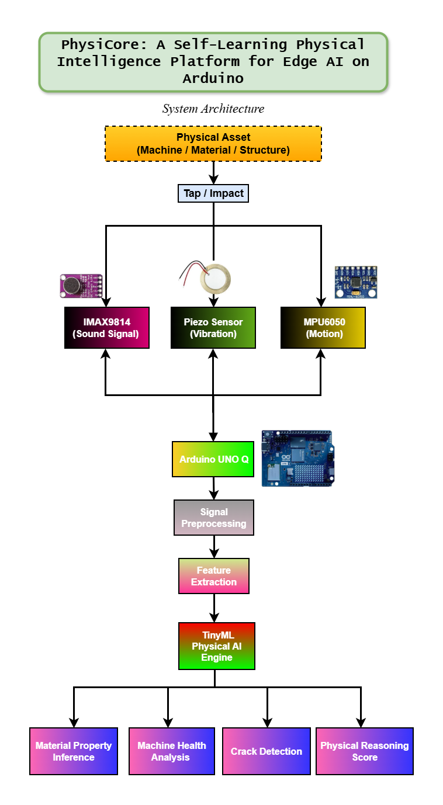

# PhysiCore
Arduino Physical AI Challenge 2026 Project

### A Self-Learning Physical Intelligence Platform for Edge AI on Arduino UNO Q


---

## Overview

PhysiCore is an Edge AI platform designed to enable Arduino UNO Q to understand the physical world using multimodal sensing.

Instead of relying on cameras, PhysiCore analyzes **sound**, **vibration**, and **motion** generated by physical interactions to infer meaningful characteristics of objects and structures.

The project combines Embedded Systems, Signal Processing, TinyML, and Physical AI to perform intelligent reasoning directly on resource-constrained hardware.

---

## Problem Statement

Current embedded AI systems primarily depend on cameras or expensive industrial sensors.

Many real-world environments require AI systems capable of understanding physical properties without vision.

PhysiCore addresses this challenge by creating a lightweight Physical AI platform capable of analyzing physical interactions using inexpensive sensors.

---

## Objectives

- Develop an original Physical AI platform
- Perform Edge AI inference on Arduino UNO Q
- Build a custom multimodal dataset
- Design a scalable hardware architecture
- Enable real-time physical reasoning

---

## Key Features

- Physical AI
- TinyML on Arduino UNO Q
- Multimodal Sensor Fusion
- Real-time Signal Processing
- Edge Intelligence
- Modular Design
- Expandable Architecture

---

## Hardware

- Arduino UNO Q
- Piezo Vibration Sensor
- MPU6050 IMU
- Breadboard
- Jumper Wires

---

## Software Stack

- Arduino IDE
- Python
- TensorFlow
- TensorFlow Lite
- TinyML
- GitHub
- VS Code

---

## Project Architecture
![Architecture]
<p align="center">
  
</p>


```text
Physical Asset
        │
Physical Interaction
(Tap / Impact)
        │
 ┌──────┼──────┐
 │             │
 ▼             ▼
Piezo      MPU6050
 │             │
 └──────┼──────┘
        │
Arduino UNO Q
        │
Signal Processing
        │
Feature Extraction
        │
TinyML Model
        │
Physical Intelligence
        │
Prediction
```

---

## Repository Structure

```text
PhysiCore/
│
├── docs/
├── hardware/
├── firmware/
├── dataset/
├── ai_model/
├── testing/
├── media/
└── README.md
```

---

## Project Workflow

1. Hardware Design
2. Sensor Integration
3. Dataset Collection
4. Signal Processing
5. Feature Extraction
6. TinyML Model Training
7. Model Deployment
8. Edge AI Inference
9. Performance Evaluation
10. Final Demonstration

---
## 👥 Team

| Role | Member | Responsibility |
|------|--------|----------------|
| Team Leader | [@SUJAN](https://github.com/OjasFlux) | Project Management & System Integration |
| Hardware Engineer | [@PRAJWAL](https://github.com/prajwalchitte46) | Sensor Integration |
| Dataset Engineer | [@NITHIN](https://github.com/1nithinn) | Dataset Collection & Labeling |
| AI Engineer | [@MANISH](https://github.com/ManishtnS18) | TinyML Development |

---

## Current Status

- [x] Project Planning
- [x] Repository Setup
- [x] Hardware Integration
- [x] Dataset Collection
- [x] TinyML Development
- [x] Testing
- [ ] Competition Submission

---

## Future Scope

- Structural Health Monitoring
- Predictive Maintenance
- Industrial Inspection
- Smart Manufacturing
- Robotics
- Material Characterization

---

## License

This project is released under the MIT License.

---

## Acknowledgements

- Arduino
- TensorFlow Lite
- TinyML Community
- Open Source Contributors

---

## Contact

Arduino Physical AI Challenge 2026 Team

Project Name:
**PhysiCore – A Self-Learning Physical Intelligence Platform for Edge AI on Arduino UNO Q**
